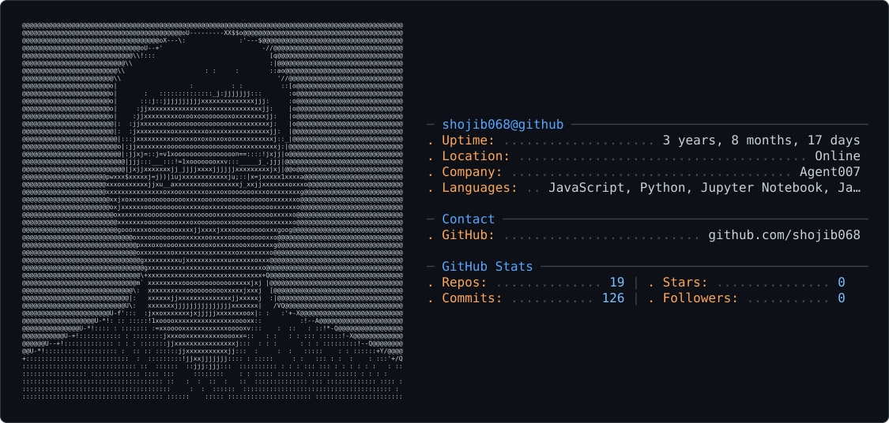

<picture>
  <source media="(prefers-color-scheme: dark)" srcset="dark_mode.svg" />
  <source media="(prefers-color-scheme: light)" srcset="light_mode.svg" />
  
</picture>
## 👋 It's Kawsar Ahmed Shojib
## Open for Research Assistant ( Domain: AI, ML, Data Science )

-  **Software Engineer @ Nazihar IT Solutions Ltd** 
-  **M.S. @ University of Chittagong** 
-  **Website Management Secretary @ CUSS** 
- 🌱 Passionate about building smart systems and learning cutting-edge data technologies.

---

### 🚀 About Me
- 🔭 Currently working on **Temenos T24 (Core Banking System)**
- 🌱 Learning **Java**, **Temenos T24**, and **InfoBasic**
- 💡 Interested in**Database Management System**, **Data Analysis**, **Machine Learning**, **AI Agents**, and **Data Visualization**
- 👯 Open to collaborating on **research-based** and **analysis-based** projects
- 💬 Ask me about **Python**, **Java**, **C**,**SQL** and **n8n automation**
- ⚡ Fun fact: *I love learning new data trends and experimenting with automation.*

---

### 🧰 Languages and Tools

